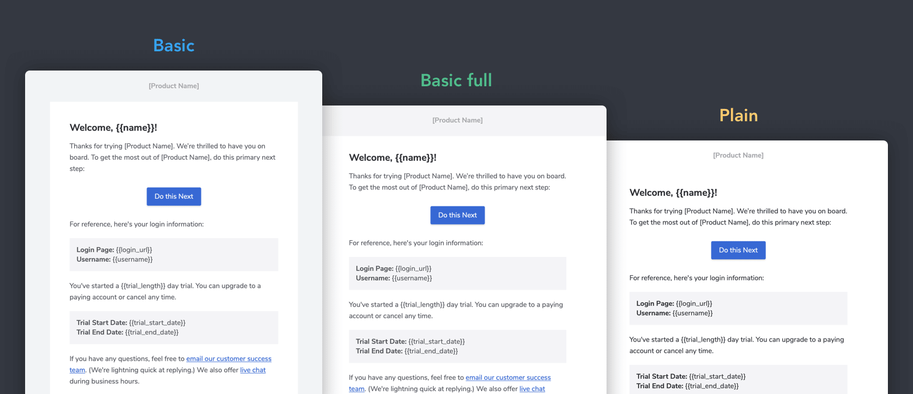
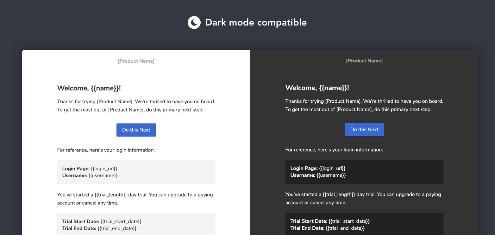

<div align="center">
  <p>
    <a href="https://maizzle.com/#gh-light-mode-only" target="_blank">
      
    </a>
    <a href="https://maizzle.com/#gh-dark-mode-only" target="_blank">
      
    </a>
  </p>
  <p>Postmark Starter</p>
</div>

# About

The transactional email templates by [Postmark](https://github.com/wildbit/postmark-templates), built with [Tailwind CSS](https://tailwindcss.com/) in [Maizzle](https://maizzle.com).

## Variations

Each template comes in three different generic layout variations: Basic, Basic full, and Plain. This gives you a starting point so that you can customize your templates to match your brand.




## Getting Started

Install the Maizzle CLI:

```
npm install -g @maizzle/cli
```

Scaffold a new project with this starter:

```
maizzle new maizzle/starter-postmark
```

Alternatively, you may clone this starter directly:

```bash
# remember to install dependencies with `npm install`
npx degit maizzle/starter-postmark
```

## Development

Start a local development server:

```
npm run dev
```

Build for production:

```
npm run build
```

Maizzle documentation is available at https://maizzle.com
